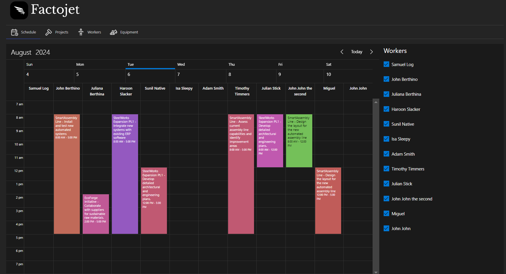
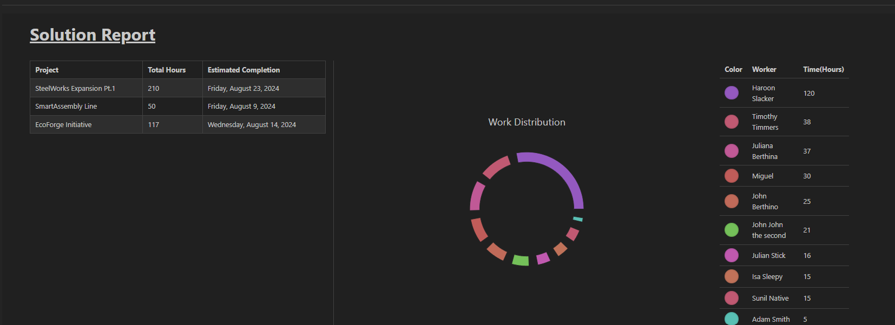
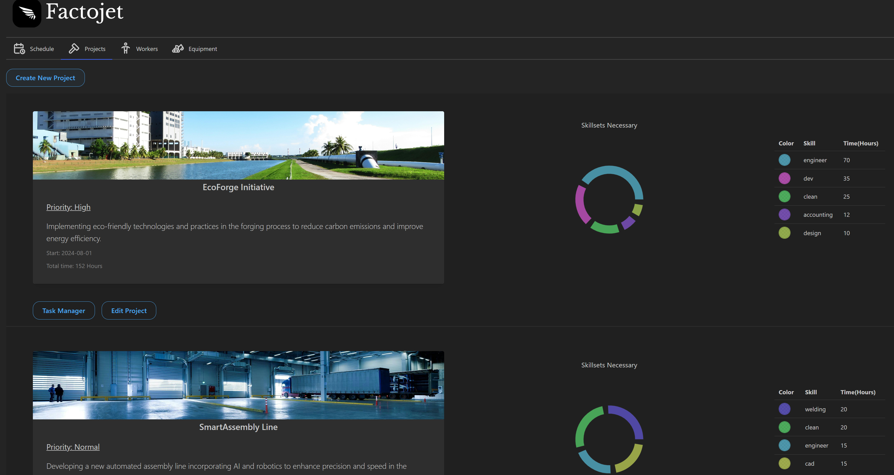
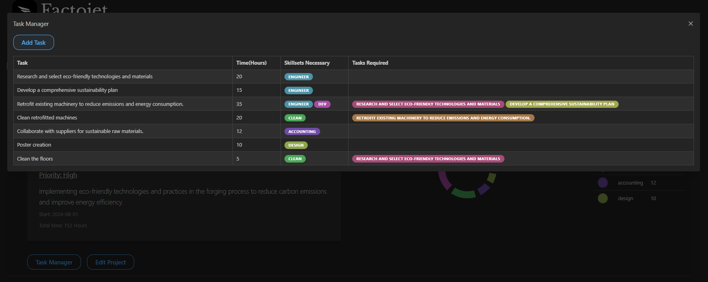
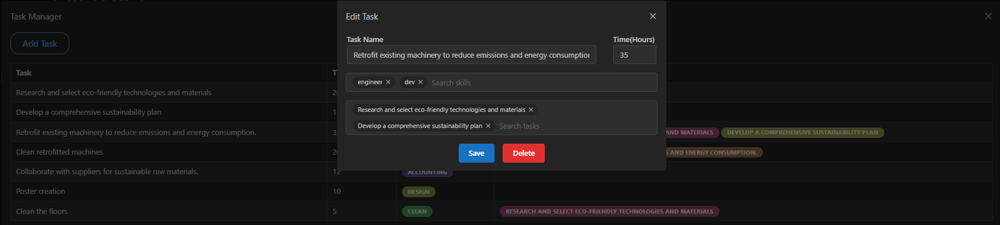
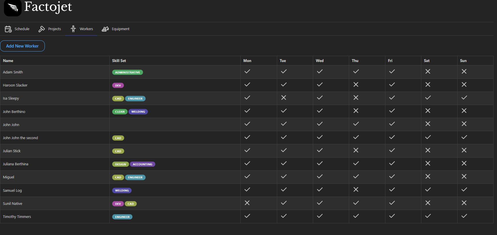
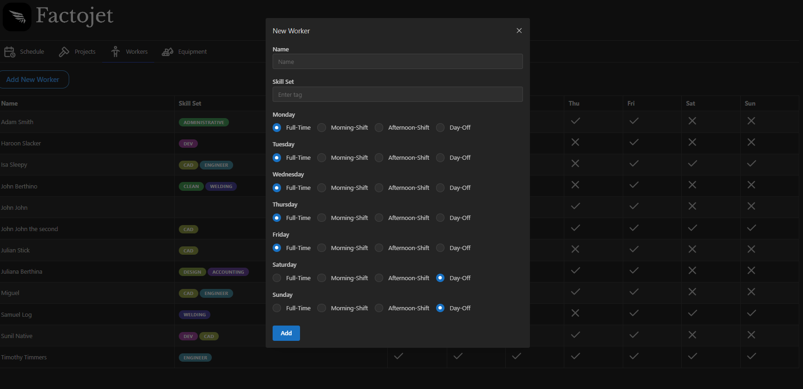

# Factojet

The app's goal is to easily organize work within a factory in a easy and automatic approach, the goal is not for a perfect automatic project management tool but for a good enough solution to manage multi project complex management problems that usually would require weeks of project management to acquire an optimal solution.

---

## How to run:

- Run npm i command inside both directories (Client + Server)

- You will need a mobiscroll account to install mobiscroll components ([MobiScroll](https://download.mobiscroll.com/trial))) 

- Change the data-source.ts inside the server folder to match your DB

- If you want to the project upload feauture working, set up your own cloudinary 
  
  - change the fetch link  and upload_preset on ProjectForm.tsx

- Run `npm run dev` on both directories

- Enjoy!

---

### Stack:

- Typescript

- Express

- TypeORM

- Postgres

- React

- Mantine

- Mobiscroll

- Cloudinary

---

## Preview

