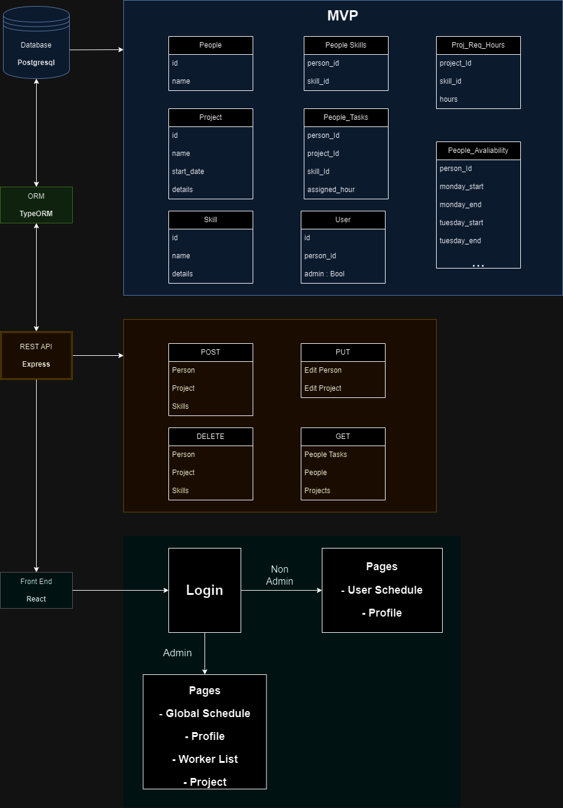
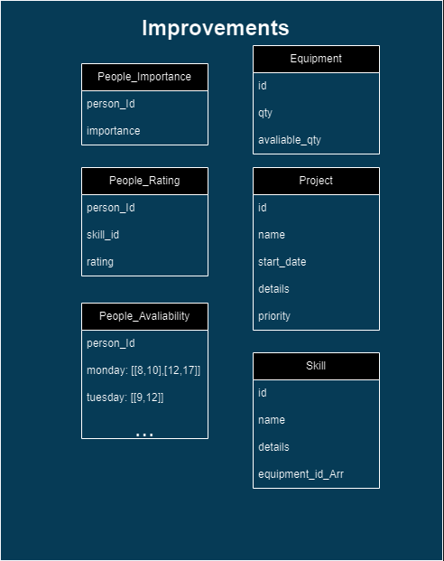

# Factory SSD

---

## Goal

The app's goal is to easily organize work within a factory in a easy and automatic approach, the goal is not for a perfect automatic project management tool but for a good enough solution to manage multi project complex management problems that usually would require weeks of project management to acquire an optimal solution.

---

## MVP

---

### Stack

- Postgresql

- TypeORM

- Express

- React

### Objectives:

- Create a schedule for the workers using their avaliability and skillsets
  
  - Global Schedule for admins
  
  - User Schedule for normal users

- Add new workers 
  
  - Name
  
  - Skillset
  
  - Profile Picture

- Edit worker information

- Add new projects
  
  - Name
  
  - Details
  
  - Picture
  
  - Skillsets Needed + Time for each skillset

- Edit project

- Add new skills
  
  - Name

---

## Improvements

As previously mentioned the main goal of the app is the reorganization and finding a good enough solution for the multi project problem, one big problem with factories on top of the distribution of work is the distribution of equipment necessary for certain tasks, so further improvements would be directed towards making a good enough algorythm to distribute work, for that the db would need to have the following changes:

#### Person Importance

This table holds the value of importance calculated by the total of hours needed for the current projects skillsets. Example:

If it's currently needed a total 150hours of CNC and 40hours of forklift, if John has both skills his value will be 190, and if Bertha only has CNC skills then Bertha will have a value of 150.

So when picking a person to do a certain task it will always pick the one with least importance.

---

#### Person Rating

The goal with the addition of ratings would be for the admin to be able to setup a minimun rating for certain projects. 

---

#### Better Person Avaliability

Save the data as arrays with time intervals for more complex avaliabilities

---

#### Equipment

In a realistic setting equipment limits the work assignment as much as the number of workers, so it should be taken into consideration in order to make it usable in a real setting, this also requires that the Skill table to hold an array with the needed equipment. 

---

#### Project Priority

This allows the admin to set a priority list of Projects